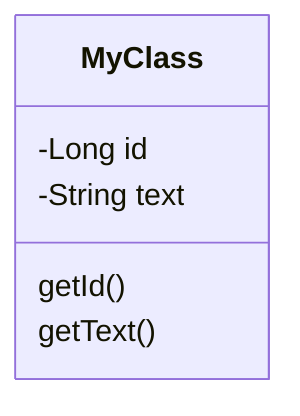

# Funktionalität
- pro Video immer nur ein Up/Downvote in jeder Kategorie
- Sicherheitshürde: Setze ein Häckchen und schon kann nur wer sich die Zeit genommen hat zu kommentieren, darf auch bewerten.
- Aufklappen von Text oder Text immer?
- Kategorien von Fähigkeiten
- Gruppen von Tieren
- Menschen unter Primaten einsortieren
- Follow-Funktion
- MongoDB

## nice to have
- site-hopping per Controller in einer Lego-Welt?
- Easter Eggs?

## Präsi
- Diesmal eine aufwendige Präsentation auf dem Niveau einer Max & Michel-PPT

