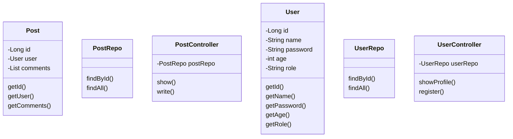
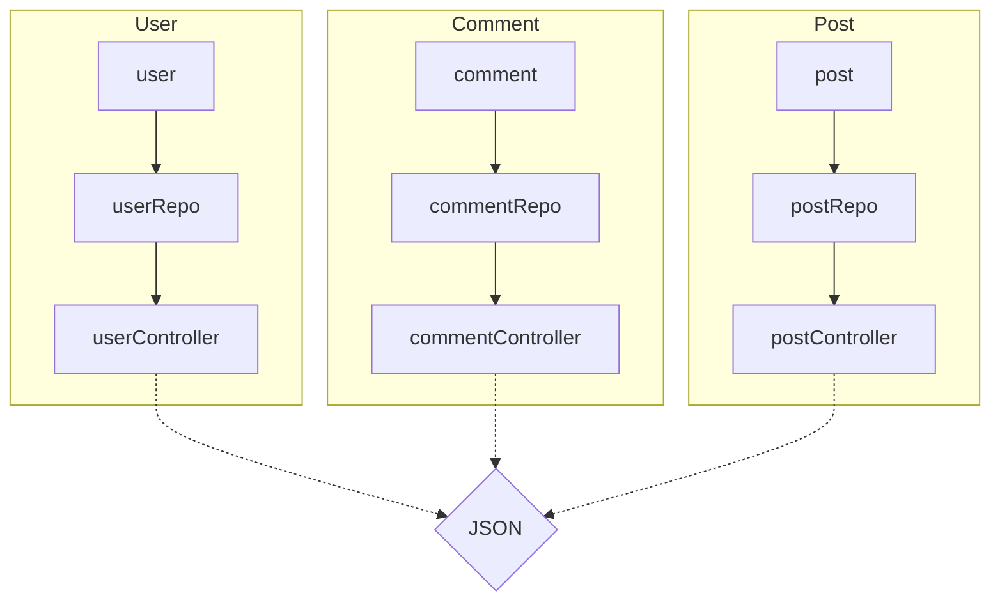
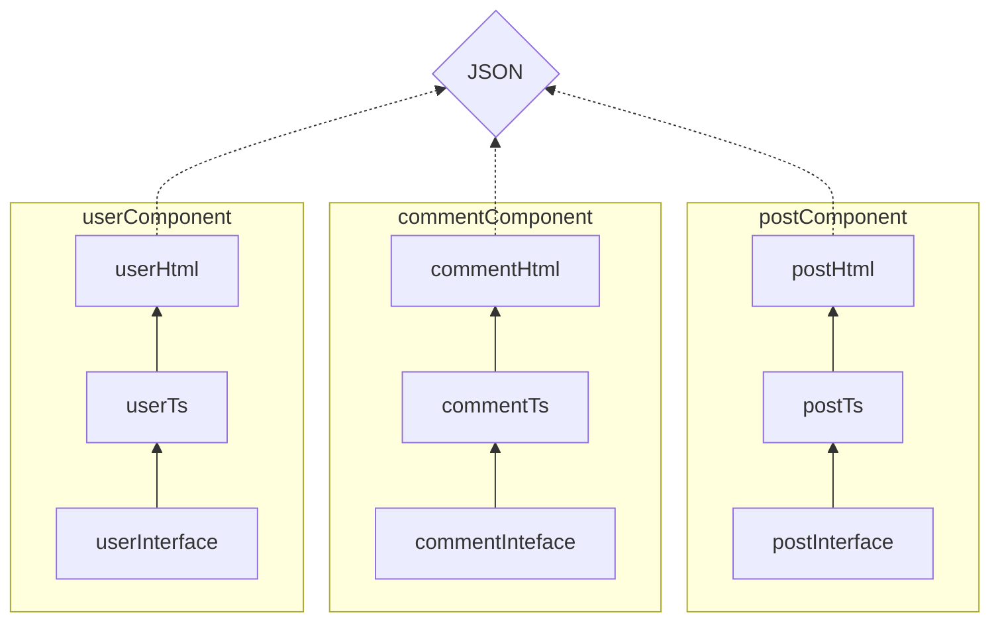

```mermaid
classDiagram
    class Post {
    -Long id
    -User user
    -List<Comment> comments
    getId()
    getUser()
    getComments()
    }
    class PostRepo {
    findById()
    findAll()
    }
    class PostController {
    -PostRepo postRepo
    show()
    write()
    }
    class User {
    -Long id
    -String name
    -String password
    -int age
    -String role
    getId()
    getName()
    getPassword()
    getAge()
    getRole()
    }
    class UserRepo {
    findById()
    findAll()
    }
    class UserController {
    -UserRepo userRepo
    showProfile()
    register()
    }
```

```mermaid
graph TB

    subgraph Post
    post-->postRepo
    postRepo-->postController
    end
    
    subgraph Comment
    comment-->commentRepo
    commentRepo-->commentController
    end
    
    subgraph User
    user-->userRepo
    userRepo-->userController
    end
    
    userController-.->localhost{JSON}
    commentController-.->localhost{JSON}
    postController-.->localhost{JSON}
    
```

```mermaid
graph BT

    userHtml-.->localhost{JSON}
    commentHtml-.->localhost{JSON}
    postHtml-.->localhost{JSON}
    
    subgraph postComponent
    postInterface-->postTs
    postTs-->postHtml
    end
    
    subgraph commentComponent
    commentInteface-->commentTs
    commentTs-->commentHtml
    end
    
    subgraph userComponent
    userInterface-->userTs
    userTs-->userHtml
    end
    
```